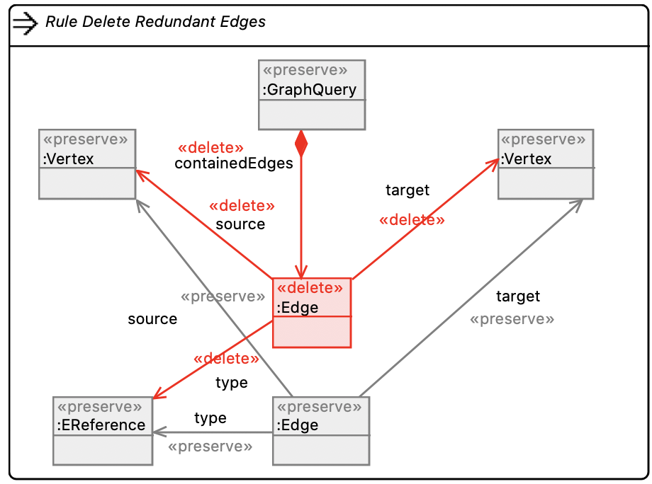
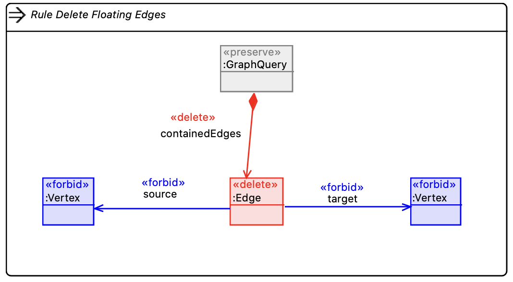
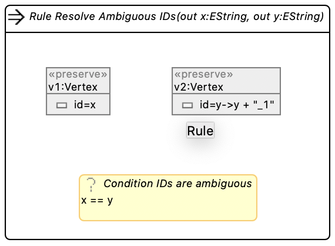

# G-GQ: Building a naïve graph querying language

## 1.

TODO: Metamodel & Sirius editor

## 2. Refactoring & Repair

### Delete redundant edges



Observations:
- simple rule, similar to the exercise tasks

### Delete floating edges



Observations:
- `<<forbid>>` is new

### Resolve amibiguous IDs



Observations:
- *OUT parameters* are new
- *Conditions* are new

## 3. Interpreter

We first implemented the naïve brute-force version propsed on the task sheet (see [cd1ea9ba](https://github.com/Mrnikbobjeff/G-GQ/commits/cd1ea9baaa6da81fdab6561bae629759cf680689)).
We've then refined it by filtering invalid matchings as soon as they break one of the queried edges.

Intuition: Given a `host` and a `query` graph, generate all type-matching mappings between the vertices of `host` and the vertices of `query`.
Ensure queried edges are present in the `host` graph incrementally by checking once both sides are mapped.

```scala
generateMappings(
  EObject[] host,
  Vertex[] query,
  Edge[] edges
): { EObject => Vertex }[] {
  if (query == ∅) { // empty queries
    yield { }         // yield empty mappings
    return
  }
  
  queryVertex = head(query) // match the of the query
  for (hostVertex : host) { // with every possible host counterpart
    if (hostVertex ∉ queryVertex.type) {
      continue 
    }

    // if type matches: recursively generate mappings for remaining vertices
    otherPossibleMappings = generateMappings(host \ hostVertex, tail(query), edges)
    for (mapping : otherPossibleMappings) {
      extendedMapping = mapping ∪ { queryVertex => hostVertex }

      edgesConcernedByThisMapping = edges.filter(edge | edge.source == queryVertex || edge.target == queryVertex)
      someEdgeHasBeenMadeImpossible = edgesConcernedByThisMapping.hasSome(edge -> {
        mappedSource = extendedMapping[edge.source]
        mappedTarget = extendedMapping[edge.target]

        edgeIsFullyMapped = mappedSource != null && mappedTarget != null
        if (!edgeIsFullyMapped) {
          return false
        }

        edgeExistsInHost = target ∈ mappedSource.getReferencedTargets(edge.type)
        edgeHasBeenMadeImpossible = !edgeExistsInHost
        return edgeHasBeenMadeImpossible
      })

      if (!someEdgeHasBeenMadeImpossible) {
        yield extendedMapping
      }
    }
  }
}
```

### Example

Given the following graph:

[](https://mermaid-js.github.io/mermaid-live-editor/#/edit/eyJjb2RlIjoiZ3JhcGggTFJcbiAgRXJpY2hfR2FtbWEgLS0gYXV0aG9yZWQgLS0-IENvbnRyaWJ1dGluZ190b19FY2xpcHNlXG4gIEVyaWNoX0dhbW1hIC0tIGF1dGhvcmVkIC0tPiBEZXNpZ25fUGF0dGVybnNcdFxuICBSYWxwaF9Kb2huc29uIC0tIGF1dGhvcmVkIC0tPiBEZXNpZ25fUGF0dGVybnNcbiAgUmljaGFyZF9IZWxtIC0tIGF1dGhvcmVkIC0tPiBEZXNpZ25fUGF0dGVybnNcbiAgSm9obl9WbGlzc2lkZXMgLS0gYXV0aG9yZWQgLS0-IERlc2lnbl9QYXR0ZXJuc1xuICBLZW50X0JlY2sgLS0gYXV0aG9yZWQgLS0-IFBsYW5uaW5nX0V4dHJlbWVfUHJvZ3JhbW1pbmdcbiAgS2VudF9CZWNrIC0tIGF1dGhvcmVkIC0tPiBDb250cmlidXRpbmdfdG9fRWNsaXBzZVxuICBNYXJ0aW5fRm93bGVyIC0tIGF1dGhvcmVkIC0tPiBQbGFubmluZ19FeHRyZW1lX1Byb2dyYW1taW5nIiwibWVybWFpZCI6eyJ0aGVtZSI6ImRlZmF1bHQifSwidXBkYXRlRWRpdG9yIjpmYWxzZX0)

Run the following two queries:

[](https://mermaid-js.github.io/mermaid-live-editor/#/edit/eyJjb2RlIjoiZ3JhcGggTFJcbiAgYTEgLS0gYXV0aG9yZWQgLS0-IGNvbW1vbl9ib29rXG4gIGEyIC0tIGF1dGhvcmVkIC0tPiBjb21tb25fYm9vayIsIm1lcm1haWQiOnsidGhlbWUiOiJkZWZhdWx0In0sInVwZGF0ZUVkaXRvciI6ZmFsc2V9)

Expected outcome: All permutations of authors who wrote a book together. Two entries per book, 12 for *Design Patterns*.

[](https://mermaid-js.github.io/mermaid-live-editor/#/edit/eyJjb2RlIjoiZ3JhcGggTFJcbiAgYTEgLS0gYXV0aG9yZWQgLS0-IGNvbW1vbl9ib29rXG4gIGEyIC0tIGF1dGhvcmVkIC0tPiBjb21tb25fYm9va1xuICBhMyAtLSBhdXRob3JlZCAtLT4gY29tbW9uX2Jvb2siLCJtZXJtYWlkIjp7InRoZW1lIjoiZGVmYXVsdCJ9LCJ1cGRhdGVFZGl0b3IiOmZhbHNlfQ)

Expected outcome: All permutations of three out of four *Design Patterns* authors.

## 4.

TODO: Henshin Transformation

## Résumé

We built a simple & naïve graph querying language.
It features a graphical editor, refactoring rules, a simplistic interpreter and interoparability with Henshin Transformations.
EMF allows to hide quite a lot of complexity under the hood, but is a rather hard-to-use tool itself.

